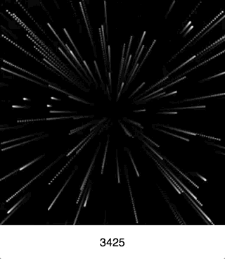

# Space Travel

This is a barely functioning example that tries to
simulate the travel through space.

Really it's just a simple implementation of canvas in
React.

Obligatory animated gif screenshot.

## Aspirations

This project aspires to provide the effect of traveling
through space. Imagine looking through the view port of
a spacecraft traveling through space.

## Built with...

[Create React App](README-react.md)
